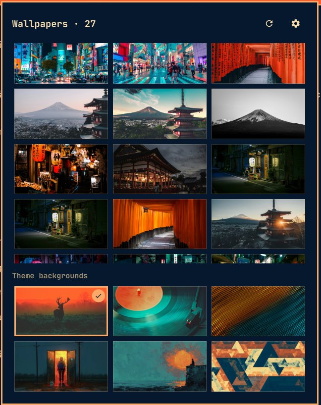

# Wallpaper Gallery for Omarchy

A bar widget for [Omarchy](https://omarchy.org) that shows the wallpapers in a
folder of your choice as a thumbnail grid. Click a thumbnail and it becomes
your background.



- Point it at **any folder** — not just your theme's backgrounds — by typing
  the path behind the gear.
- Optionally **include subfolders**, so a whole wallpaper collection shows up
  in one grid.
- A **Theme backgrounds** section below the grid keeps the current theme's own
  wallpapers one click away too.
- **Keep wallpaper across theme switches**: normally `omarchy theme set` swaps
  in the theme's own background — this toggle keeps your pick on screen
  through theme changes, without so much as a flicker.
- **Middle-click** the bar icon to jump to a random wallpaper from the folder
  without opening the panel.
- Thumbnails are generated once with `vipsthumbnail` and cached, so listing
  stays in the low milliseconds even for a folder of a thousand 4K images.

## Requirements

Omarchy with the Quickshell-based shell (`omarchy plugin` and
`omarchy bar` commands available). `vipsthumbnail` — which Omarchy already
ships for its own background switcher — is optional: without it the grid
shows the full-size originals instead of cached thumbnails.

## Install

```bash
omarchy plugin add https://github.com/andreas-bylund/omarchy-simple-wallpaper-gallery.git
```

`omarchy plugin add` offers to enable the plugin straight away. Decline if
you want to read the code first — as does `--yes`, which adds it without
prompting and leaves it disabled — then enable it when you are ready:

```bash
omarchy plugin enable bylund.wallpaper-gallery
```

The widget appears in the right section of the bar; move it with
`omarchy bar move bylund.wallpaper-gallery --section <left|center|right>`.

## Use

| Action | Effect |
|---|---|
| Left-click the bar icon | Open the gallery |
| Middle-click the bar icon | Set a random wallpaper from the folder |
| Right-click the bar icon | Open straight into the settings |
| Click a thumbnail | Set it as the background |
| Arrow keys / `hjkl` + Enter | Pick with the keyboard |
| `,` | Toggle settings |
| `r` | Rescan the folder |
| `s` | Random wallpaper |
| `Esc` | Leave settings, then close the panel |

The first time you open the panel it takes you straight to the settings: type
the path to the folder holding your wallpapers and press Enter or **Use**.
`~/Pictures/wallpapers` works, as does `$HOME/...` or a full path. The gear in
the panel header brings you back there, along with the **Include subfolders**
and **Keep wallpaper across theme switches** toggles.

## Settings

Settings live inline on the widget's entry in `~/.config/omarchy/shell.json`
and can also be set from a terminal:

```bash
omarchy bar set bylund.wallpaper-gallery folder '"~/Pictures/wallpapers"' --json
omarchy bar set bylund.wallpaper-gallery includeSubfolders true --json
omarchy bar set bylund.wallpaper-gallery keepAcrossThemes true --json
omarchy bar set bylund.wallpaper-gallery columns 4 --json
```

| Key | Type | Default | Meaning |
|---|---|---|---|
| `folder` | path | `""` | The wallpaper folder. `~` and `$HOME` are expanded |
| `includeSubfolders` | boolean | `false` | Also list images in nested folders |
| `keepAcrossThemes` | boolean | `false` | Restore your last gallery pick after theme switches |
| `columns` | integer | `3` | Grid columns (2–5). Terminal-only; the panel has no control for it |

## How keeping the wallpaper works

Your last pick is remembered in
`~/.local/state/omarchy-wallpaper-gallery/last-wallpaper`. With the toggle on,
two things keep it in place:

1. **Keep-links** — every theme's user-background folder
   (`~/.config/omarchy/backgrounds/<theme>/`) gets a symlink named
   `.00-wallpaper-gallery-current.*` pointing at your pick, creating the
   folder if it does not exist. When a theme switch finds that the background
   in use is not among the new theme's backgrounds, `omarchy-theme-set` falls
   back to the first background it can find — and user backgrounds sort first
   — so the switch "transitions" from your wallpaper to itself. No flash of
   the theme's own background at all.
2. **A theme-set hook** — a small self-contained script in
   `~/.config/omarchy/hooks/theme-set.d/wallpaper-gallery-keep` acts as the
   fallback for themes installed after the links were seeded: it restores
   your pick and seeds the missing link so the next switch is seamless. It
   also retires itself, links and all, the first time it runs after the
   plugin directory is gone.

**Side effect worth knowing about.** The keep-link is a real image file as far
as Omarchy is concerned, so while the toggle is on your kept wallpaper also
appears as an extra tile in the stock background switcher
(`omarchy theme bg-switcher`) and in the `omarchy theme bg next` cycle, for
every theme. That is inherent to the trick: the link has to live where
`omarchy-theme-set` looks. Turning the toggle off removes every link and
restores the stock behavior exactly.

## Uninstall

Turn the keep toggle off first, or run the cleanup directly — either removes
the theme-set hook, every keep-link, the thumbnail cache and the saved state,
while leaving any background folder you filled yourself untouched:

```bash
~/.config/omarchy/plugins/bylund.wallpaper-gallery/bin/wallpaper-gallery uninstall
omarchy plugin remove bylund.wallpaper-gallery
```

Removing the plugin without doing that is not fatal: the hook notices the
plugin is gone the next time you switch themes and cleans up after itself.

## Notes

- Setting a wallpaper goes through `omarchy-theme-bg-set`, the same command
  the stock background switcher uses, so nothing else about theming changes
  (but see the side effect above when the keep toggle is on).
- Supported formats: jpg, jpeg, png, gif, bmp, webp. Hidden folders inside the
  wallpaper folder are skipped, recursion is capped at four levels and does
  not cross filesystems, so a stray symlink cannot turn the scan loose on your
  whole home directory.
- A filename containing a newline cannot be carried by the row protocol and is
  skipped; tabs are fine.
- The thumbnail cache lives in `~/.cache/omarchy-wallpaper-gallery`, keyed by
  path, size and mtime. Every generation pass ends by dropping the rows and
  thumbnails of images that have since been edited, renamed or deleted, so it
  does not grow without bound. `bin/wallpaper-gallery prune` does the same on
  demand, and deleting the folder outright is always safe.

## Development

The QML is a view over `bin/wallpaper-gallery`, which does all the filesystem
work and is usable on its own:

```bash
bin/wallpaper-gallery list ~/Pictures/wallpapers 1
bin/wallpaper-gallery current
bin/wallpaper-gallery prune
tests/run-tests.sh
```

The widget answers on its own IPC target, which is handy while hacking on it:

```bash
omarchy-shell bylund.wallpaper-gallery status    # folder, image count, current
omarchy-shell bylund.wallpaper-gallery refresh
omarchy-shell bylund.wallpaper-gallery random
```

The tests run against a throwaway `HOME`, so they never touch your real
Omarchy state. CI runs them together with `shellcheck` on every push.

## License

MIT
